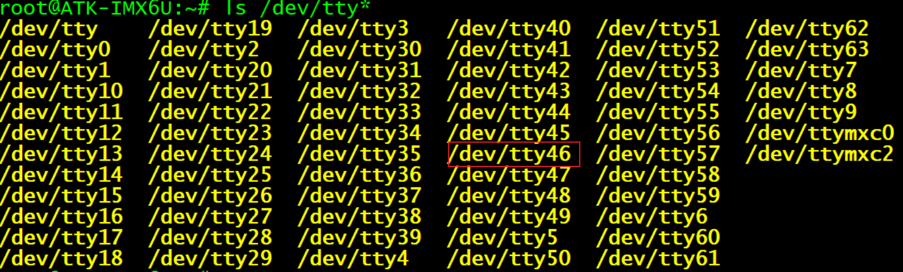
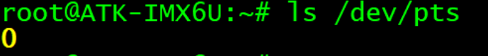
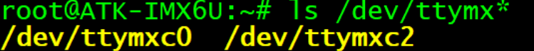

# Linux传串口应用编程

## 1.串口应用编程介绍

与`stm32`中不同之处在于，`linux`中的串口除了作为通信协议与外设进行通信外，还充当了**终端**的作用。

### 1.1 终端（Terminal）

终端就是处理主机输入、输出的一套设备，它用来显示主机运算的输出，并且接受主机要求的输入。典型的终端包括显示器键盘套件,打印机打字机套件等。

**终端分类**
  
- **本地终端**：本地电脑的键盘鼠标，显示器
- **串口中断**：通过串口打印与输入构成
- **基于网络的远程中断**：通过`ssh`、`Telnet`协议登录到远程主机

**终端对应的设备节点**

- /dev/ttyX (X表示数字编号)，本地终端，在linux内核初始化时生成63个本地终端

- /dev/pts/X, 网络虚拟节点

- /dev/ttymxcX, 串口终端设备节点, 主要串口节点的命名在不同设备上不同


### 1.2 串口应用编程

串口的应用编程也很简单，无非就是通过 `ioctl()` 对串口进行配置，调用 `read()` 读取串口的数据、调
用 `write()` 向串口写入数据

但是为了方便，`linux` 提供了更上层的一套 `API` 函数，`termios API`, 实现对所有终端设备进行控制。使用时，应用程序中需要包含 `termios.h` 头文件

### 1.3 `strcut termios` 结构体

**作用：**
实现对应终端控制的参数配置

`strcut termios`结构题的定义如下：
```c
struct termios 
{ 
    tcflag_t c_iflag;    // 输入模式
    tcflag_t c_oflag;    // 输出模式
    tcflag_t c_cflag;    // 控制模式
    tcflag_t c_lflag;    // 本地模式
    cc_t c_line;         // 线路规程
    cc_t c_cc[NCCS];     // 特殊控制字符
    speed_t c_ispeed;    // 输入速率
    speed_t c_ospeed;    // 输出速率
}; 
```
### 1.4 终端的三种工作模式

终端有三种工作模式，分别为规范模式（canonical mode）、非规范模式（non-canonical mode）和原始
模式（raw mode）

- **规范模式**：所有的输入是基于行进行处理的，用户输入一个回车符表示一行结束；
- **非规范模式**：所有输入是及时有效的，即输入的每一个字符直接能够被使用，而不需要一行结束
- **原始模式**：一种特殊的非规范模式，所有的输入的数据以字节为单位被处理，**串口通信**采用的就是这种方式

### 1.5 打开串口设备 `open()`

使用 `open()` 函数打开串口的设备节点文件：

```c
int fd;

fd = open("/dev/ttymxc2", O_RDWR | O_NOCTTY);
if (0 > fd) {
    perror("open error");
    return -1;
}
```
调用 `open()` 函数时，使用了 `O_NOCTTY` 标志，该标志用于告知系统 `/dev/ttymxc2` 它不会成为进程的控制终端。

### 1.6 获取终端当前的配置参数：`tcgetattr()` 函数

该函数将当前终端的配置参数保存在一个 `termios` 结构体中

```c
struct termios old_cfg; 
if (0 > tcgetattr(fd, &old_cfg)) { 
    /* 出错处理 */ 
    do_something(); 
}
```

### 1.7 对串口终端进行配置

**(1)配置串口终端为原始模式**
调用 `<termios.h>` 头文件中申明的 `cfmakeraw()` 函数可以将终端配置为原始模式： 

```c
struct termios new_cfg; 
memset(&new_cfg, 0x0, sizeof(struct termios)); 

//配置为原始模式 
cfmakeraw(&new_cfg);
```

**(2) 接收使能**
使能接收功能只需在 `struct termios` 结构体的 `c_cflag` 成员中添加 `CREAD` 标志即可:

```c
new_cfg.c_cflag |= CREAD;   //接收使能
```

**(3) 设置串口的波特率**
设置波特率的主要函数有 `cfsetispeed()` 和 `cfsetospeed()`，这两个函数在 `<termios.h>` 头文件中申明:

```c
cfsetispeed(&new_cfg, B115200);  // 设置数据输入波特率
cfsetospeed(&new_cfg, B115200);  // 设置数据输出波特率
```

除了之外，我们还可以直接使用 `cfsetspeed()` 函数一次性设置输入和输出波特率:

```c
cfsetspeed(&new_cfg, B115200); 
```

这几个函数在成功时返回 `0`，失败时返回 `-1`。

**(4) 设置数据位大小**

通过位掩码来操作、设置数据位大小
首先将 `c_cflag` 成员中 `CSIZE` 位掩码所选择的几个 `bit` 位清零，然后再设置数据位大小

```c
new_cfg.c_cflag &= ~CSIZE; 
new_cfg.c_cflag |= CS8;     //设置为8位数据位
```

**(5) 设置奇偶校验位** 

1. 首先对于 `c_cflag` 成员，需要添加 `PARENB` 标志以使能串口的奇偶校验功能
2. 对于 `c_iflag` 成员来说，还需要添加 `INPCK` 标志，这样才能对接收到的数据执行奇偶校验

```c
//奇校验使能 
new_cfg.c_cflag |= (PARODD | PARENB); 
new_cfg.c_iflag |= INPCK; 
 
//偶校验使能 
new_cfg.c_cflag |= PARENB; 
new_cfg.c_cflag &= ~PARODD; /* 清除PARODD标志，配置为偶校验 */ 
new_cfg.c_iflag |= INPCK; 
 
//无校验 
new_cfg.c_cflag &= ~PARENB; 
new_cfg.c_iflag &= ~INPCK; 
```

**(6) 设置停止位**

停止位则是通过设置 `c_cflag` 成员的 `CSTOPB` 标志而实现的。若停止位为一个比特，则清除 `CSTOPB`标志；若停止位为两个，则添加 `CSTOPB` 标志即可:

```c
// 将停止位设置为一个比特 
new_cfg.c_cflag &= ~CSTOPB; 
 
// 将停止位设置为2个比特 
new_cfg.c_cflag |= CSTOPB; 
```

**(7) 设置MIN和TIME的值**

`MIN` 和 `TIME` 的取值会影响非规范模式下 `read()` 调用的行为特征:

- MIN: MIN个字节可读,数据返回
- TIME: 者两个输入字符之间的时间间隔超过 `TIME` 个十分之一秒,数据返回


以将 `MIN` 和 `TIME` 设置为 `0`，这样则在任何情况下`read()`调用都会立即返回，此时对串口的 `read`操作会设置为非阻塞方式:

```c
new_cfg.c_cc[VTIME] = 0; 
new_cfg.c_cc[VMIN] = 0; 
```

**(8) 缓冲区处理**

串口在使用之前，其缓冲区中可能会预留一些数据，我们需要对其进行处理：

常见的处理方式有如下两种：

```c
// 串口进行阻塞，直到缓冲区数据全部输出
tcdrain(fd); 

// 清空缓冲区
tcflush(fd, TCIOFLUSH); 
```

**写入配置、使配置生效：`tcsetattr()`函数**

通过 `tcsetattr()` 函数将配置参数写入到硬件设备, 函数原型如下：

```c
#include <termios.h> 
#include <unistd.h> 

/*
    fd: 串口节点文件描述符
    optional_actions：
        1.TCSANOW：配置立即生效
        2.TCSADRAIN：配置在所有写入fd的输出都传输完毕之后生效
        3.TCSAFLUSH：所有已接收但未读取的输入都将在配置生效之前被丢弃
    termios_p：配置参数结构体 termios
*/
int tcsetattr(int fd, int optional_actions, const struct termios *termios_p);
```

**(10) 读写数据：read()、write()**

所有准备工作完成之后，接着便可以读写数据了，直接调用 `read()`、`write()`函数即可！

## 2. 串口应用编程实战

```c
#define _GNU_SOURCE     //在源文件开头定义_GNU_SOURCE宏 
#include <stdio.h> 
#include <stdlib.h> 
#include <sys/types.h> 
#include <sys/stat.h> 
#include <fcntl.h> 
#include <unistd.h> 
#include <sys/ioctl.h> 
#include <errno.h> 
#include <string.h> 
#include <signal.h> 
#include <termios.h>

typedef struct uart_hardware_cfg {
    unsigned int baudrate;      /* 波特率 */ 
    unsigned char dbit;         /* 数据位 */ 
    char parity;                /* 奇偶校验 */ 
    unsigned char sbit;         /* 停止位 */ 
} uart_cfg_t; 

static struct termios old_cfg;  //用于保存终端的配置参数 
static int fd;      //串口终端对应的文件描述符

/** 
 ** 串口初始化操作 
 ** 参数device表示串口终端的设备节点 
 **/ 
static int uart_init(const char *device) 
{ 
    /* 打开串口终端 */ 
    fd = open(device, O_RDWR | O_NOCTTY); 
    if (0 > fd) { 
        fprintf(stderr, "open error: %s: %s\n", device, strerror(errno)); 
        return -1; 
    } 
 
    /* 获取串口当前的配置参数 */ 
    if (0 > tcgetattr(fd, &old_cfg)) { 
        fprintf(stderr, "tcgetattr error: %s\n", strerror(errno)); 
        close(fd); 
        return -1; 
    } 
 
    return 0; 
}

/** 
 ** 串口配置 
 ** 参数cfg指向一个uart_cfg_t结构体对象 
 **/
static int uart_cfg(const uart_cfg_t *cfg)
{
    struct termios new_cfg = {0};   //将new_cfg对象清零
    speed_t speed; 

    /* 设置为原始模式 */ 
    cfmakeraw(&new_cfg);

    /* 使能接收 */ 
    new_cfg.c_cflag |= CREAD;

    /* 设置波特率 */ 
    switch (cfg->baudrate) { 
    case 1200: speed = B1200; 
        break; 
    case 1800: speed = B1800; 
        break; 
    case 2400: speed = B2400; 
        break; 
    case 4800: speed = B4800; 
        break; 
    case 9600: speed = B9600; 
        break; 
    case 19200: speed = B19200; 
        break; 
    case 38400: speed = B38400; 
        break; 
    case 57600: speed = B57600; 
        break; 
    case 115200: speed = B115200; 
        break; 
    case 230400: speed = B230400; 
        break; 
    case 460800: speed = B460800; 
        break; 
    case 500000: speed = B500000; 
        break; 
    default:    //默认配置为115200 
        speed = B115200; 
        printf("default baud rate: 115200\n"); 
        break; 
    } 

    if (0 > cfsetspeed(&new_cfg, speed)) { 
        fprintf(stderr, "cfsetspeed error: %s\n", strerror(errno)); 
        return -1; 
    }

    /* 设置数据位大小 */ 
    new_cfg.c_cflag &= ~CSIZE;  //将数据位相关的比特位清零

    switch (cfg->dbit) { 
    case 5: 
        new_cfg.c_cflag |= CS5; 
        break; 
    case 6: 
        new_cfg.c_cflag |= CS6; 
        break; 
    case 7: 
        new_cfg.c_cflag |= CS7; 
        break; 
    case 8: 
        new_cfg.c_cflag |= CS8; 
        break; 
    default:    //默认数据位大小为8 
        new_cfg.c_cflag |= CS8; 
        printf("default data bit size: 8\n"); 
        break; 
    } 

    /* 设置奇偶校验 */ 
    switch (cfg->parity) { 
    case 'N':       //无校验 
        new_cfg.c_cflag &= ~PARENB; 
        new_cfg.c_iflag &= ~INPCK; 
        break; 
    case 'O':       //奇校验 
        new_cfg.c_cflag |= (PARODD | PARENB); 
        new_cfg.c_iflag |= INPCK; 
        break; 
    case 'E':       //偶校验 
        new_cfg.c_cflag |= PARENB; 
        new_cfg.c_cflag &= ~PARODD; /* 清除PARODD标志，配置为偶校验 */ 
        new_cfg.c_iflag |= INPCK; 
        break; 
    default:    //默认配置为无校验 
        new_cfg.c_cflag &= ~PARENB; 
        new_cfg.c_iflag &= ~INPCK; 
        printf("default parity: N\n"); 
        break; 
    } 

    /* 设置停止位 */ 
    switch (cfg->sbit) {
    case 1:     //1个停止位 
        new_cfg.c_cflag &= ~CSTOPB; 
        break; 
    case 2:     //2个停止位 
        new_cfg.c_cflag |= CSTOPB; 
        break; 
    default:    //默认配置为1个停止位 
        new_cfg.c_cflag &= ~CSTOPB; 
        printf("default stop bit size: 1\n"); 
        break; 
    }

    /* 将MIN和TIME设置为0 */ 
    new_cfg.c_cc[VTIME] = 0; 
    new_cfg.c_cc[VMIN] = 0; 

    /* 清空缓冲区 */ 
    if (0 > tcflush(fd, TCIOFLUSH)) { 
        fprintf(stderr, "tcflush error: %s\n", strerror(errno)); 
        return -1; 
    } 

    /* 写入配置、使配置生效 */ 
    if (0 > tcsetattr(fd, TCSANOW, &new_cfg)) { 
        fprintf(stderr, "tcsetattr error: %s\n", strerror(errno)); 
        return -1; 
    }

     /* 配置OK 退出 */ 
    return 0; 
}


/*** -
-dev=/dev/ttymxc2
--brate=115200 
--dbit=8 
--parity=N 
--sbit=1 
--type=read 
***/

/** 
 ** 打印帮助信息 
 **/ 
static void show_help(const char *app) 
{ 
    printf("Usage: %s [选项]\n" 
        "\n必选选项:\n" 
        "  --dev=DEVICE     指定串口终端设备名称, 譬如--dev=/dev/ttymxc2\n" 
        "  --type=TYPE      指定操作类型, 读串口还是写串口, 譬如--type=read(read表示读、write表示
写、其它值无效)\n" 
        "\n可选选项:\n" 
        "  --brate=SPEED    指定串口波特率, 譬如--brate=115200\n" 
        "  --dbit=SIZE      指定串口数据位个数, 譬如--dbit=8(可取值为: 5/6/7/8)\n" 
        "  --parity=PARITY  指定串口奇偶校验方式, 譬如--parity=N(N表示无校验、O表示奇校验、E表
示偶校验)\n" 
        "  --sbit=SIZE      指定串口停止位个数, 譬如--sbit=1(可取值为: 1/2)\n" 
        "  --help           查看本程序使用帮助信息\n\n", app); 
}

/** 
 ** 信号处理函数，当串口有数据可读时，会跳转到该函数执行 
 **/ 
static void io_handler(int sig, siginfo_t *info, void *context) 
{ 
    unsigned char buf[10] = {0}; 
    int ret; 
    int n; 
 
    if(SIGRTMIN != sig) 
        return; 
 
    /* 判断串口是否有数据可读 */ 
    if (POLL_IN == info->si_code) { 
        ret = read(fd, buf, 8);     //一次最多读8个字节数据 
        printf("[ "); 
        for (n = 0; n < ret; n++) 
            printf("0x%hhx ", buf[n]); 
        printf("]\n"); 
    } 
}

/** 
 ** 异步I/O初始化函数 
 **/
static void async_io_init(void) 
{ 
     struct sigaction sigatn; 
    int flag; 
 
    /* 使能异步I/O */ 
    flag = fcntl(fd, F_GETFL);  //使能串口的异步I/O功能 
    flag |= O_ASYNC; 
    fcntl(fd, F_SETFL, flag); 
 
    /* 设置异步I/O的所有者 */ 
    fcntl(fd, F_SETOWN, getpid()); 
 
    /* 指定实时信号SIGRTMIN作为异步I/O通知信号 */ 
    fcntl(fd, F_SETSIG, SIGRTMIN); 
 
    /* 为实时信号SIGRTMIN注册信号处理函数 */ 
    sigatn.sa_sigaction = io_handler;   //当串口有数据可读时，会跳转到io_handler函数 
    sigatn.sa_flags = SA_SIGINFO; 
    sigemptyset(&sigatn.sa_mask); 
    sigaction(SIGRTMIN, &sigatn, NULL); 
}

int main(int argc, char *argv[])
{
    uart_cfg_t cfg = {0}; 
    char *device = NULL; 
    int rw_flag = -1; 
    unsigned char w_buf[10] = {0x11, 0x22, 0x33, 0x44, 
                0x55, 0x66, 0x77, 0x88};    //通过串口发送出去的数据 
    int n;

    /* 解析出参数 */ 
    for (n = 1; n < argc; n++) { 
 
        if (!strncmp("--dev=", argv[n], 6)) 
            device = &argv[n][6]; 
        else if (!strncmp("--brate=", argv[n], 8)) 
            cfg.baudrate = atoi(&argv[n][8]); 
        else if (!strncmp("--dbit=", argv[n], 7)) 
            cfg.dbit = atoi(&argv[n][7]); 
        else if (!strncmp("--parity=", argv[n], 9)) 
            cfg.parity = argv[n][9]; 
        else if (!strncmp("--sbit=", argv[n], 7)) 
            cfg.sbit = atoi(&argv[n][7]);
        else if (!strncmp("--type=", argv[n], 7)) { 
            if (!strcmp("read", &argv[n][7])) 
                rw_flag = 0;        //读 
            else if (!strcmp("write", &argv[n][7])) 
                rw_flag = 1;        //写 
        } 
        else if (!strcmp("--help", argv[n])) { 
            show_help(argv[0]); //打印帮助信息 
            exit(EXIT_SUCCESS); 
        } 
    } 

    if (NULL == device || -1 == rw_flag) { 
        fprintf(stderr, "Error: the device and read|write type must be set!\n"); 
        show_help(argv[0]); 
        exit(EXIT_FAILURE); 
    } 

    /* 串口初始化 */ 
    if (uart_init(device)) 
        exit(EXIT_FAILURE); 
 
    /* 串口配置 */ 
    if (uart_cfg(&cfg)) { 
        tcsetattr(fd, TCSANOW, &old_cfg);   //恢复到之前的配置 
        close(fd); 
        exit(EXIT_FAILURE); 
    } 

    /* 读|写串口 */ 
    switch (rw_flag) { 
    case 0:  //读串口数据 
        async_io_init(); //我们使用异步I/O方式读取串口的数据，调用该函数去初始化串口的异步I/O 
        for ( ; ; ) 
            sleep(1);    //进入休眠、等待有数据可读，有数据可读之后就会跳转到io_handler()函数 
        break; 
    case 1:   //向串口写入数据 
        for ( ; ; ) {     //循环向串口写入数据 
            write(fd, w_buf, 8);  //一次向串口写入8个字节 
            sleep(1);         //间隔1秒钟 
        } 
        break; 
    } 

    /* 退出 */ 
    tcsetattr(fd, TCSANOW, &old_cfg);   // 恢复到之前的配置 
    close(fd); 
    exit(EXIT_SUCCESS);
}
```