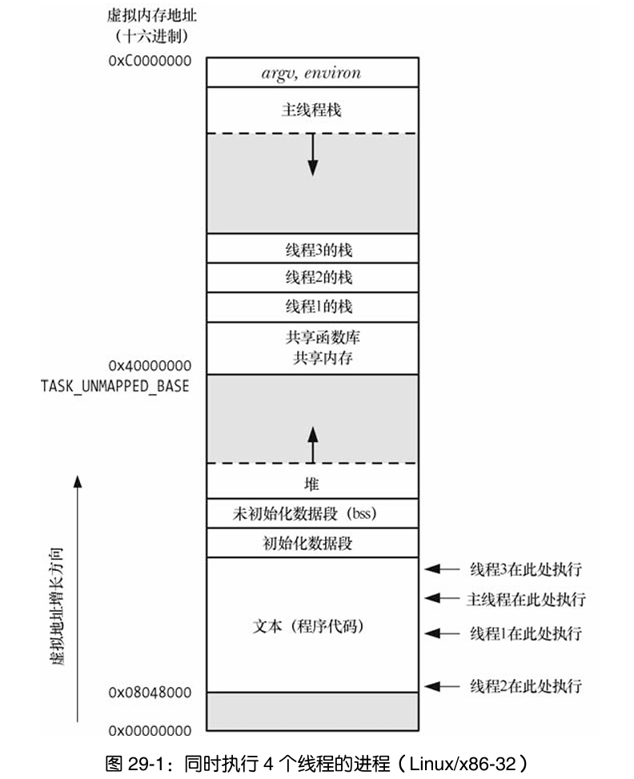

# Linux环境下的线程

## 1. 介绍

### 1.1 概述

与进程（process）类似，线程（thread）是允许应用程序**并发执行**多个任务的一种机制。如下图所示，一个进程可以包含多个线程。同一程序中的所有线程均会独立执行相同程序，且**共享同一份全局内存**区域，其中包括初始化数据段（initialized data）、未初始化数据段（uninitialized data），以及堆内存段（heap segment）



同一个进程中的多个线程可以并发执行。

对于某些应用而言，线程要优于进程。主要体现下面两个方面：
1. 进程间的信息难以共享
2. 调用 `fork()` 来创建进程的代价相对较高

线程解决了上述两个问题：
1. 线程之间能够方便、快速地共享信息
2. 创建线程比创建进程通常要块10倍还要多

除了全局内存之外，线程还共享了一些其他属性

### 1.2 创建线程

启动程序时，产生的进程只有单条线程，称之为初始（initial）或主（main）线程，讨论其他线程的创建过程

函数 `pthread_create()` 负责创建一条新线程:

```c
#include <pthread.h> 

int pthread_create(pthread_t *thread, 
                    const pthread_attr_t *attr, 
                    void *(*start_routine) (void *), 
                    void *arg); 
```

**`thread`**: 线程ID，后续用来指向这个线程
**`attr`**: 定义了线程的各种属性
**`start_routine`**: 线程函数
**`arg`**: 传递给 start_routine()函数的参数
**返回值**：成功返回0；失败时将返回一个错误号，并且参数thread指向的内容是不确定的

> 线程创建后，无法确定系统会率先调度哪个一个线程来执行，如果有执行顺序的要求，则必须采用一些同步技术

使用案例：

```c
#include <stdio.h> 
#include <stdlib.h> 
#include <pthread.h> 
#include <string.h> 
#include <unistd.h> 
#include <sys/types.h> 
#include <unistd.h> 
 
static void *new_thread_start(void *arg) 
{ 
    printf("新线程: 进程ID<%d>  线程ID<%lu>\n", getpid(), pthread_self()); 
    return (void *)0; 
} 
 
int main(void) 
{ 
    pthread_t tid; 
    int ret; 
 
    ret = pthread_create(&tid, NULL, new_thread_start, NULL); 
    if (ret) { 
        fprintf(stderr, "Error: %s\n", strerror(ret)); 
        exit(-1); 
    } 
 
    printf("主线程: 进程ID<%d>  线程ID<%lu>\n", getpid(), pthread_self()); 
    sleep(1); 
    exit(0); 
} 
```

### 1.3 终止线程

可以如下方式终止线程的运行： 
- 线程 `start` 函数执行 `return` 语句并返回指定值。 
- 线程调用 `pthread_exit()`
- 调用 `pthread_cancel()` 取消线程
- 任意线程调用了 `exit()`，或者主线程执行了 `return` 语句（在main()函数中），都会导致进程中的所有线程立即终止。 

如果主线程调用了 `pthread_exit()`，而非调用 `exit()`或是执行 `return` 语句，那么其他线程将继续运行

使用案例：
```c
#include <stdio.h> 
#include <stdlib.h> 
#include <pthread.h> 
#include <string.h> 
#include <unistd.h> 
#include <sys/types.h> 
#include <unistd.h> 
 
static void *new_thread_start(void *arg) 
{ 
    printf("新线程start\n"); 
    sleep(1); 
    printf("新线程end\n"); 
    pthread_exit(NULL); 
} 
 
int main(void) 
{ 
    pthread_t tid; 
    int ret; 
 
    ret = pthread_create(&tid, NULL, new_thread_start, NULL); 
    if (ret) { 
        fprintf(stderr, "Error: %s\n", strerror(ret)); 
        exit(-1); 
    } 
 
    printf("主线程end\n"); 
    pthread_exit(NULL); 
    exit(0); 
} 
```

### 1.4 线程ID

就像每个进程都有一个进程ID一样，每个线程也有其对应的标识，称为线程ID

一个线程可通过库函数 `pthread_self()` 来获取自己的线程ID

```c
#include <pthread.h> 

pthread_t pthread_self(void); 
```

可以使用pthread_equal()函数来检查两个线程ID是否相等

```c
#include <pthread.h> 

int pthread_equal(pthread_t t1, pthread_t t2); 
```

### 1.5 连接（joining）已终止的线程-->线程回收

函数 `pthread_join()` **等待**由 `thread` 标识的线程终止。（如果线程已经终止，`pthread_join()`会立即返回）。这种操作被称为连接(joining)

```c
#include <pthread.h> 

int pthread_join(pthread_t thread, void **retval); 
```

若 `retval` 为一非空指针，将会保存线程终止时返回值的拷贝，该返回值亦即线程调用 `return` 或 `pthred_exit()` 时所指定的值

1. 如向 `pthread_join()` 传入一个之前已然连接过的线程ID，将会导致无法预知的行为
2. 若线程并未分离（`detached`），则必须使用 `ptherad_join()` 来进行连接, 否则将会产生僵尸线程

使用案例：

```c
#include <stdio.h> 
#include <stdlib.h> 
#include <pthread.h> 
#include <string.h> 
#include <unistd.h> 
#include <sys/types.h> 
#include <unistd.h> 
 
static void *new_thread_start(void *arg) 
{ 
    printf("新线程start\n"); 
    sleep(2); 
    printf("新线程end\n"); 
    pthread_exit((void *)10); 
} 
 
int main(void) 
{ 
    pthread_t tid; 
    void *tret; 
    int ret; 
 
    ret = pthread_create(&tid, NULL, new_thread_start, NULL); 
    if (ret) { 
        fprintf(stderr, "pthread_create error: %s\n", strerror(ret)); 
        exit(-1); 
    } 
 
    ret = pthread_join(tid, &tret); 
    if (ret) { 
        fprintf(stderr, "pthread_join error: %s\n", strerror(ret)); 
        exit(-1); 
    } 
    printf("新线程终止, code=%ld\n", (long)tret); 
 
    exit(0);
}
```

### 1.6 线程的分离

除了使用 `pthread_join` 来回收线程外，有时我们并不需要获取线程的返回状态，只希望线程终止时能够自动的清理并除之。此时，可以使用 `pthread_detach()` 来标记线程处于**分离状态**，线程终止时，其会自动的清理。

```c
#include <pthread.h>

int pthread_detach(pthread_t thread);
```

1. 一旦线程处于分离状态，就不能再使用 `pthread_join()` 来获取其状态，也无法使其重返“可连接”状态。
2. `pthread_detach()`只是标记线程处于分离状态，并不能终止线程

### 1.7 线程vs进程

进程是资源分配最小单位，线程是 CPU 调度最小单位。
1. 资源：进程独立内存，线程共享进程资源，仅私有栈寄存器；
2. 切换：进程切换开销大，线程切换轻量；
3. 通信：进程用 IPC，线程直接共享内存 + 锁同步；
4. 容错：线程崩进程全挂，进程间互不影响；
5. 创建：进程 fork 复制资源，线程创建开销小。

### 1.8 总结

在多线程程序中，多个线程并发执行同一程序。所有线程共享相同的全局和堆变量，但每个线程都配有用来存放局部变量的私有栈。同一进程中的线程还共享一干其他属性，包括进程ID、打开的文件描述符、信号处置、当前工作目录以及资源限制。 

线程与进程间的关键区别在于，线程比进程更易于共享信息，这也是许多应用程序舍进程而取线程的主要原因。对于某些操作来说（例如，创建线程比创建进程快），线程还可以提供更好的性能。但是，在程序设计的进程/线程之争中，这往往不会是决定性因素。 

可使用 `pthread_create()` 来创建线程。每个线程随后可调用 `pthread_exit()` 独立退出。（如有任一线程调用了 exit()，那么所有线程将立即终止。）除非将线程标记为分离状态（例如通过调用 `pthread_ detached()`），其他线程要连接该线程，则必须使用`pthread_join()`，由其返回遭连接线程的退出状态