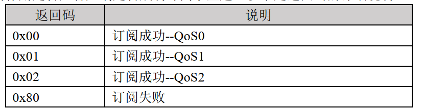

# MQTT Study Note

## 1. MQTT 简介

MQTT 协议是应用层协议，工作在 TCP/IP 四层模型中的最上层（应用层），构建于TCP/IP协议上。
MQTT 最大优点在于，可以以极少的代码和有限的带宽，为连接远程设备提供实时可靠的消息服务。

### 1.1 MQTT 的主要特性

- 使用发布/订阅消息模式，提供一对多的消息发布，解除应用程序耦合
- 基于TCP/IP提供网络连接
- 支持QoS服务质量等级 （*根据消息的重要性不同设置不同的服务质量等级*）
- 小型传输，开销很小，协议交换最小化，以降低网络流量
- 使用will遗嘱机制来通知客户端异常断线
- 基于主题发布/订阅消息，对负载内容屏蔽的消息传输
- 支持心跳机制

> 由于需要时不时发送心跳包，因此 MQTT 并不适合低功耗的场所

### 1.2 MQTT 的版本

1. MQTT 的两个主流版本为 MQTT3.1 和 MQTT5
2. 主要使用的还是 MQTT3.1
3. MQTT5 是对 MQTT3.1 的部分升级与扩充

## 2. MQTT 协议

### 2.1 通信基本原理

MQTT 是一种基于**客户端-服务端**架构的消息传输协议，所以在 MQTT协议 通信中，有两个最为重要的角色，它们便是服务端和客户端。

#### 2.1.1 服务端

通常是一台服务器，可以实现多个客户端连接一个服务端

#### 2.1.1 客户端

1. 通常实际执行具体操作的独立个体，能与服务端进行通信
2. 客户端发送消息的行为称为 **发布**
3. 客户端想要接收服务端的消息，需要想服务端 **订阅** 消息

#### 2.1.3 MQTT 主题

1. 客户端想要接收服务器的某个主题的消息，需要先订阅该主题
2. 客户端想要发送消息给服务器，需要指定订阅的主题
3. 主题可以理解为特定的功能，比如led控制主题这种
   
#### 2.1.4 MQTT 发布/订阅特性

- 客户端相互独立
- 空间上可分离
- 时间上可异步

### 2.2 连接 MQTT 服务端

MQTT 客户端连接服务器分为以下两个步骤：
1. 客户端发送 `CONNECT` 报文
2. 服务端回复 `CONNACK` 报文

#### 2.2.1 CONNECT 报文

1. 客户端向服务端发送 `CONNECT` 报文请求连接
2. 一个 MQTT 报文组成为：固定头、可变头、消息载体
3. `CONNECT` 报文必须包含：`clientID`、`keepAlibe`、`cleanSession`这三部分
4. `clientID`: 用于告诉服务端，是哪个客户端请求连接，每个不同的客户端的id并不相同
5. `keepAlibe`: 心跳时间间隔，设置一个时间，检测客户端的连接状态；客户端发送一个心跳，服务端接收后回复一个心跳响应，确认客户端还在连接
6. `cleanSession`: 是否清除会话；设置为 0 ，则不清除会话，即使断开连接后，服务端存储这段时间的消息，待重新连接后，一并发送。设置为 1，则清除回环，断开连接后会直接丢失断连这段时间的消息。
7. `cleanSession`：设置为 0，还会保存客户端断连之前订阅的主题，设置为 1，则不会

#### 2.2.2 CONNACK 报文

1. 服务端回复客户端 `CONNACK` 报文
2. `CONNACK` 报文包含：`returnCode` 和 `sessionPresent`两部分
3. `returnCode` 返回码：表示是否连接成功，为 0 的话，表示 MQTT连接成功，其他则不成功
4. `sessionPresent` 当前会话的状态：与前面`cleanSession`相对应
5. `cleanSession`为 0，表示为保持会话，会保存消息，对应回复的`sessionPresent`为 1
6. `cleanSession`为 1，表示为临时会话，不会保存消息，对应回复的`sessionPresent`为 0


### 2.3 断开连接

客户端通过向服务端发送一个 `DISCONNECT` 报文来断开连接

### 2.4 发布消息、订阅主题与取消订阅主题

#### 2.4.1 PUBLISH 发布消息

1. 客户端向服务端发送消息（必须带上一个**主题**），实际上就是发布一个 `PUBLISH` 报文
2. `PUBLISH` 报文包含以下信息：
   
|名称 | 内容|
|----|----|
|`packetId`|111|
|`topicName`|"myTopic"|
|`payload`|"Hello World"|
|`qos`|0|
|`retain`|false|
|`dup`|dup|

- `packetId`:报文标识符，与 `qos`有关，用于区分不同的报文
- `topicName`:主题名字，对应主题的名字，是一个字符串，用于区分
- `payload`：有效载荷，实际需要发布的内容
- `qos`：服务质量等级，表示 MQTT 消息的服务质量等级，有怎样的等级就有怎样的质量
- `retain`：保留标志
- `dup`重发标志：客户端发布消息后，如果服务器没有回复报文，则客户端会重新发送报文，此时 `dup` 会为 `true`，表示重新发送

3. 服务端接收到客户端发送的 `PUBLISH` 报文后，会回复一个 `PUBACK` 报文
   
#### 2.4.2 SUBSCRIBE 订阅主题

1. 客户端想要接收到服务端的某个主题的消息，需要先订阅该主题
2. 实际上就是发送一个 `SUBSCRIBE` 订阅报文
3. 一个`SUBSCRIBE` 订阅报文可以同时订阅多个主题
4. 每个主题的订阅根据设置的 `Qos` 来提供相应的服务保证
5. 订阅成功后，服务端会回复一个 `SUBACK` 报文，表示订阅的状态
6. `SUBACK` 报文包含订阅返回码和报文标识符两个部分，其中订阅返回码表示是否订阅成功
7. 

#### 2.4.3 UNSUBSCRIBE 取消订阅主题

1. 客户端订阅了某一主题之后，可以随时取消订阅
2. 客户端通过向服务端发送一个 `UNSUBSCRIBE` 报文来取消订阅主题
3. 当服务端接收到 `UNSUBSCRIBE` 报文后, 回复一个 `UNSUBACK` 报文（取消订阅确认报文）

### 2.5 主题的进阶知识

#### 2.5.1 主题的基本形式

1. 主题的基本形式就是一个字符串
2. 主题是区分大小写的
3. 主题可以使用空格
4. 不要使用中文主题

#### 2.5.2 主题分级

MQTT协议为了更好的对主题进行管理和分类，支持主题分级，对主题进行分级处理，各个级别之间使用 `/` 符号进行分隔：
如下图所示：
`"home/sensor/led/brightness"`
在以上示例中一共有四级主题，分别是第 1 级 `home`、第 2 级 `sensor`、第三级 `led`、第 4 级 `brightness`
- 主题的每一级至少需要一个字符
- 主题名称不要使用 `/` 开头

#### 2.5.3 主题通配符

1. MQTT中可以通过主题通配符实现同时订阅多个主题
2. `+`单级通配符
- 比如订阅 `home/sensor/+/status`
- 会同时订阅下面主题：
```c
"home/sensor/led/status"
"home/sensor/key/status"
"home/sensor/beeper/status"
```

3. `#`多级通配符
- 比如订阅 `"home/sensor/#"`
- 会同时订阅下面主题：
```c
"home/sensor/led"
"home/sensor/key"
"home/sensor/beeper"
"home/sensor/led/status"
"home/sensor/led/brightness"
"home/sensor/key/status"
"home/sensor/beeper/status"
```

#### 2.5.4 主题应用注意事项

**1. 以`$`开头的主题**
以$号开头的主题是 MQTT 服务端系统保留的特殊主题，客户端不可随意订阅或向其发布信息

**2. 不要使用“/”作为主题开头**

**3. 主题中不要使用空格**

**4. 保持主题简洁明了**

**5. 主题中尽量使用 ASCII 字符**

### 2.6 Qos

1. Qos 是 Quality of Service 的缩写，服务质量，决定消息的服务质量
2. Qos 有三个等级分别是0、1、2
3. Qos = 0, 等级最低，发送端只发生一遍，不考虑是否接收到了
4. Qos = 1, 等级稍高，至少发送一遍，如果接收端没有返回应答，则发送端一直发送
5. Qos = 2, 等级最高，保证接收一次，实现流程如下：
- 发送端 -- 发布消息 -- 接收端
- 接收端 -- 发布收到 -- 发送端
- 发送端 -- 发送释放 -- 接收端
- 接收端 -- 发布完成 -- 发送端
1. 服务质量降级：服务端会主动采用较低级别的 QoS 来实现消息传输

### 2.7 保留信息

1. `PUBLISH` 报文中有一个 retain 标志，也就是保留标志，是一个布尔值
2. 当 `retain` 设置为 `true` 时表示保留消息
3. 设置为 `false` 表示不保留消息
4. 发送设置保留消息的消息后，这个服务端会保存这条消息，当有新的客户端订阅主题时，会立马推送这条存储的消息
5. 每个主题只能有一个保留消息，发布消息会进行覆盖 

### 2.8 心跳机制

1. 作用：检测客户端是否还在线
2. 客户端定时向服务端发送一个心跳包，实际上就是 `PINGREQ` 报文
3. 服务端接收后，回复一个 `PINGRESP` 报文，称之为心跳响应

### 2.9 遗嘱机制

1. 在客户端**意外断连**时，MQTT 会触发遗嘱机制
2. 遗嘱机制由：遗嘱主题、遗嘱消息、遗嘱保存标志位、遗嘱服务等级组成
3. 在客户端进行 `CONNECT` 连接服务端时，将遗嘱机制内容上传至服务端
4. 当客户端意外断连时，订阅了该客户端遗嘱主题的其他客户端会接收到其遗嘱消息
   
### 2.10 用户密码认证

1. `CONNECT` 有两个重要的可选参数 `username` 和 `password`
2. 有些 MQTT 服务端开启了用户密码认证，客户端在进行连接时需要输入正确的用户名与密码
3. 只有都正确了，才能进行正常通信


